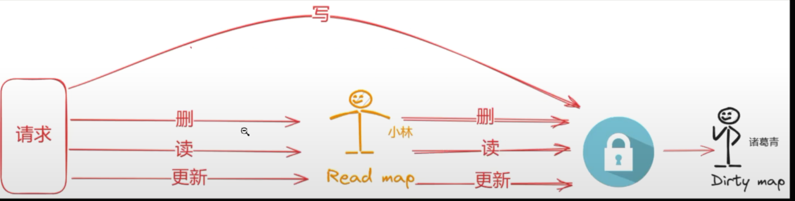
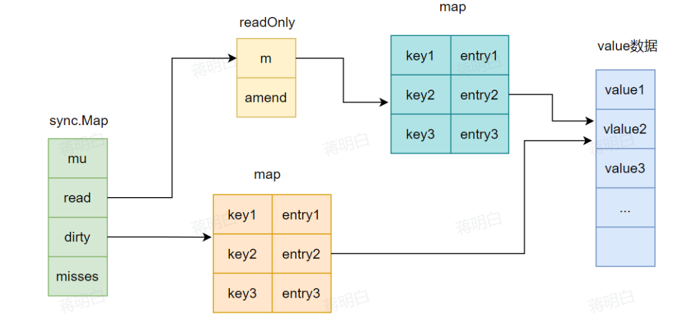
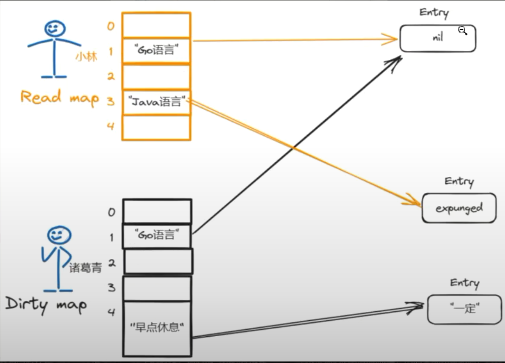

# sync.Map
## 什么是sync.Map？
- 如果要实现并发访问map，通常是加锁，但性能很差
- sync.Map采用空间换时间的策略实现读写分离，利用read map处理读、更新、删除操作，当read map没有值或者写操作时再加锁🔒访问dirty map。
- 只有读读是并发安全的

## 双向流转机制

## sync.Map数据结构
```go
type Map struct {
    mu Mutex //用于保护dirty字段的锁
    read atomic.Value // 只读字段，其实际的数据类型是一个readOnLy结构
    dirty map[interface{}]*entry //需要加锁才能访问的map，其中包含在read中除了被expunged的元素和新加入的元素
    misses int // 计数器，记录在从read中读取数据的时候，没有命中的次数，当misses值等于dirty长度，dirty转变为read
}
// readOnly is an immutable struct stored atomically in the Map read field.
type readOnly struct {
    m map[interface{}]*entry //key为任意可比较类型，value位为entry指针的一个map
    amended bool // amended为true，表明dirty中包含read中没有的数据，为false表明dirty中的数据read中都存在
}
type entry struct {
    p unsafe.Pointer //p指向真正的value所在的地址
}
```

## entry 三种状态
这个p有三种取值：
- p为nil,软删除状态，代表这个key被删除了，entry还存在，只是值为nil。，此时dirty要么为nil，要么也存在这个key
- p为expunged：硬删除状态，物理上，dirty map没有这个值了。此时dirty非空，p存在于read，但不存在于dirty
都代表逻辑删除，区别就在于dirty map中是否还存在该值。

- p为正常值: entry表示正常的value