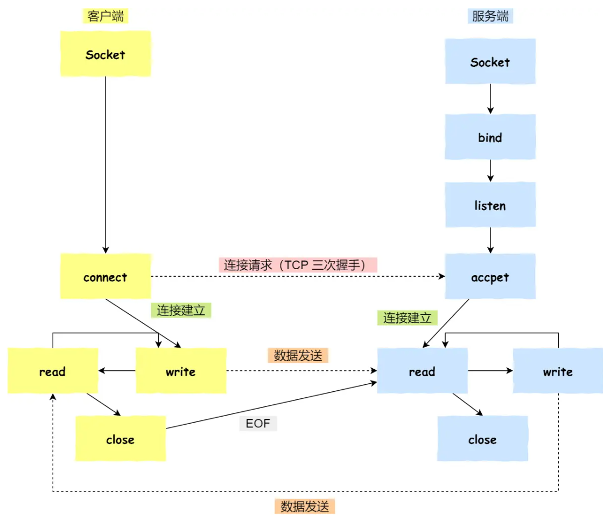
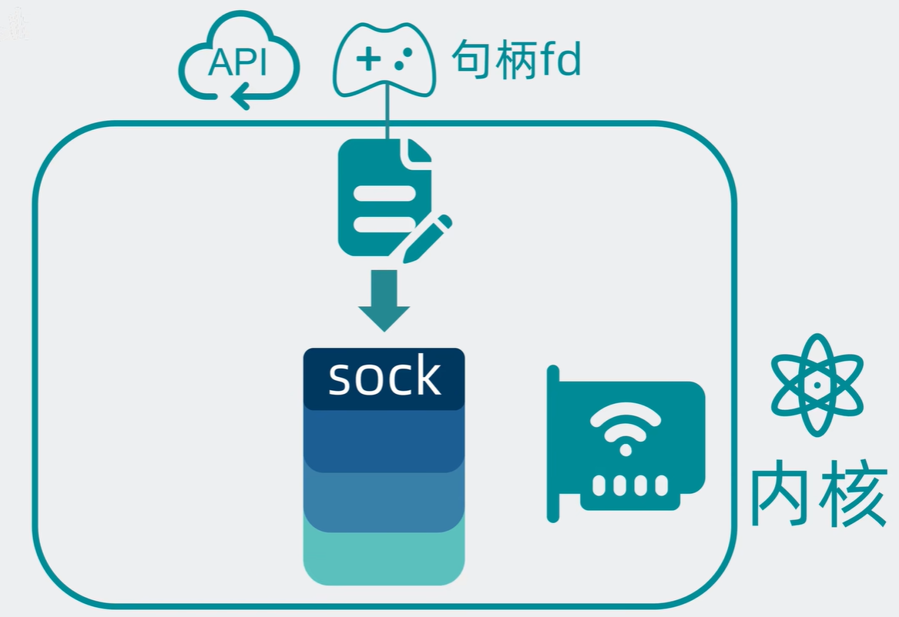
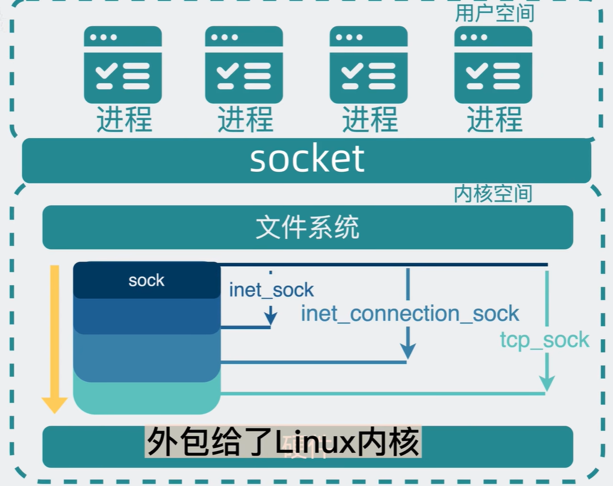

# 理解
可以把简单的把socket理解为插头，通信两端通过将socket接入本机，开始通信。

# 基于TCP的socket通信模型

- 服务端和客户端初始化socket,得到文件描述符;
- 服务端调用 bind，将绑定在IP 地址和端口;
- 服务端调用 listen ,进行监听;
- 服务端调用 accept ,等待客户端连接;
- 客户端调用 connect,向服务器端的地址和端口发起连接请求;
- 服务端 accept 返回用于传输的 socket 的文件描述符;
- 客户端调用 write 写入数据;服务端调用 read 读取数据;
- 客户端断开连接时,会调用 close ,那么服务端read 读取数据的时候,就会读取到了EOF ,待处理完数据后，服务端调用 close，表示连接关闭。
这里需要注意的是，服务端调用accept时，连接成功了会返回一个已完成连接的 socket，后续用来传
输数据。所以，监听的 socket 和真正用来传送数据的 socket，是「两个」socket，一个叫作监听 socket，一个叫
作已完成连接 socket。
> 看到这里就有点懵了，首先，插头的比喻就有点不好理解了，socket的文件描述符，意思是要操作socket？如何操作插头？另外，为什么要两个socket？
# socket内核实现
基于面向对象思想，定义基础结构体sock实现功能，各个协议可基于此数据结构做扩展：
- ip 定位主机
- 端口号 定位进程
- 发送缓冲区
- 接受缓冲区
因为sock需要和网卡对接，所以放在linux内核。
创建sock时也创建一个文件，同时得到文件句柄fd（文件的身份证），和linux中均为文件的思想统一：

这样，sock就变成了特殊的文件，用户拿到文件句柄socket fd，再通过api接口，就能够操作sock，这就是socket。
所以socket本质上就是代码库，通过socket fd操作指定的sock。
通常说的创建一个socket，就可以理解为创建了一个sock，socket通过内核返回的唯一fd操作这个sock。

为什么需要两个socket？
- 服务端listen的时候，多个客户端发送数据包到listen socket上，服务端如何区分这些客户端？客户端的数据包包含源ip、源端口、目标ip、目标端口，服务器将它们分别生成唯一的hash key，一个hash key对应一个sock，之后通过hash key找到sock，完成通信功能。
- 所以，listen socket监听端口，创建连接；已完成连接的socket与各个客户端进行通信。

参考
- [socket到底是什么？](https://www.bilibili.com/video/BV12A411X7gY)