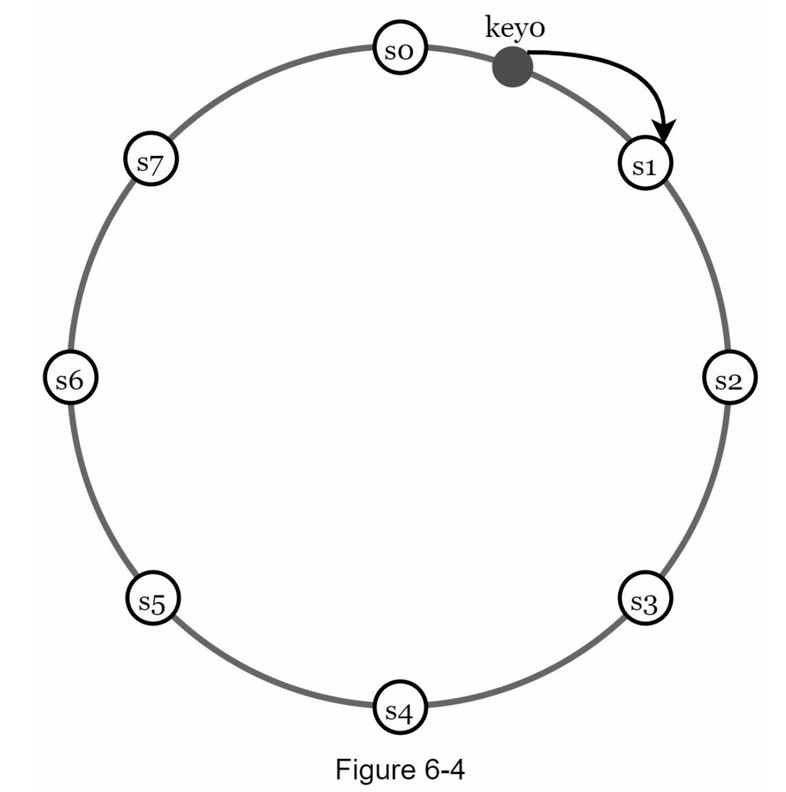
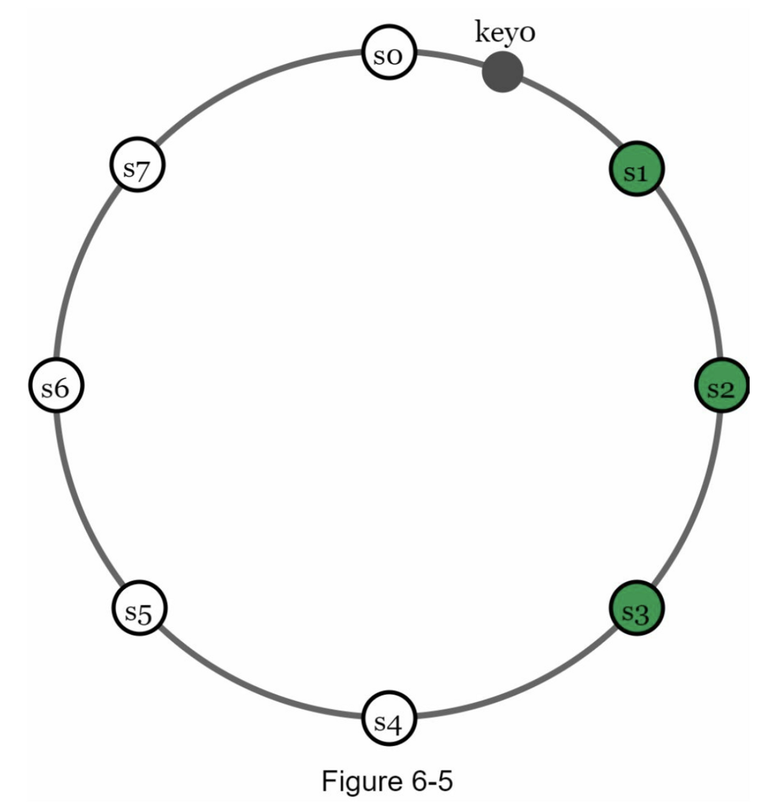
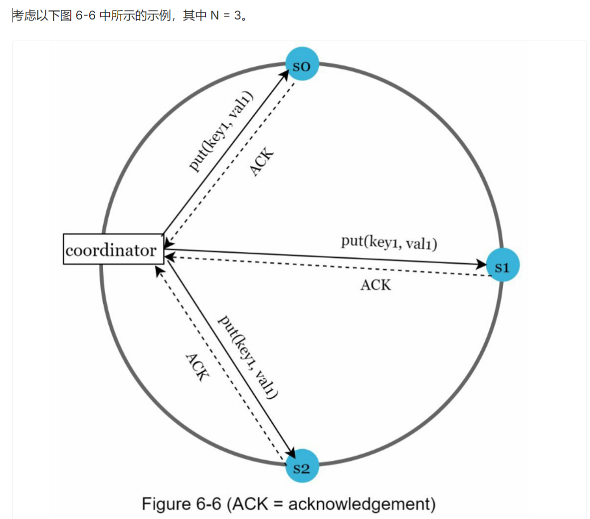
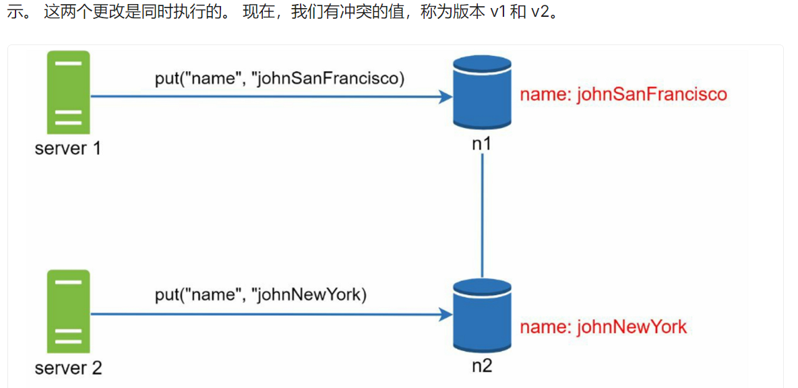
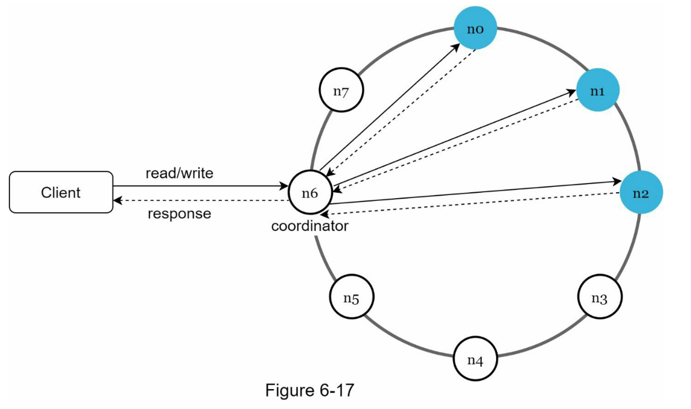
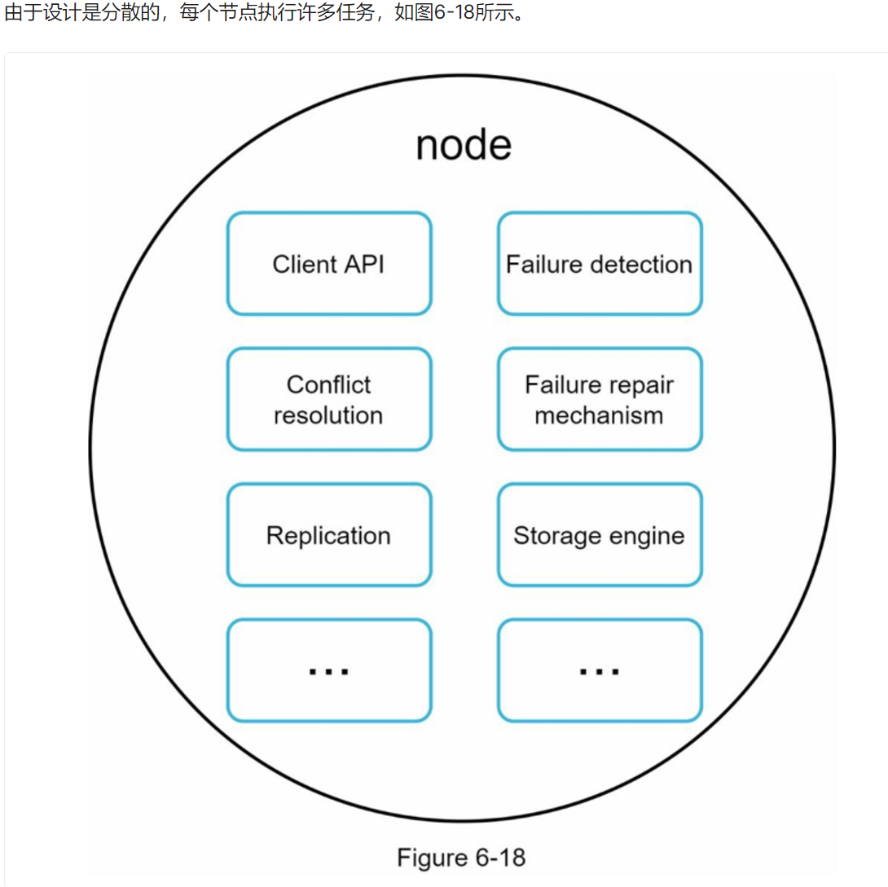
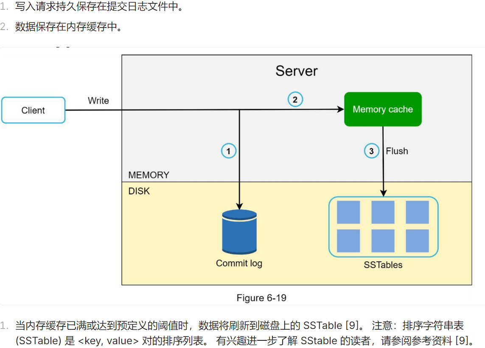
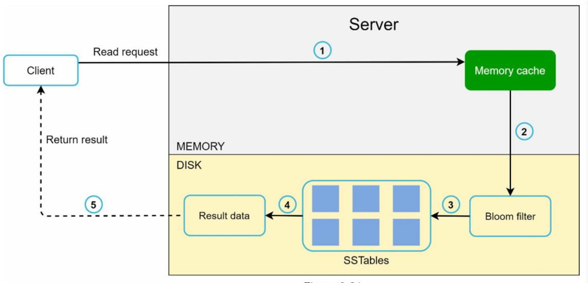
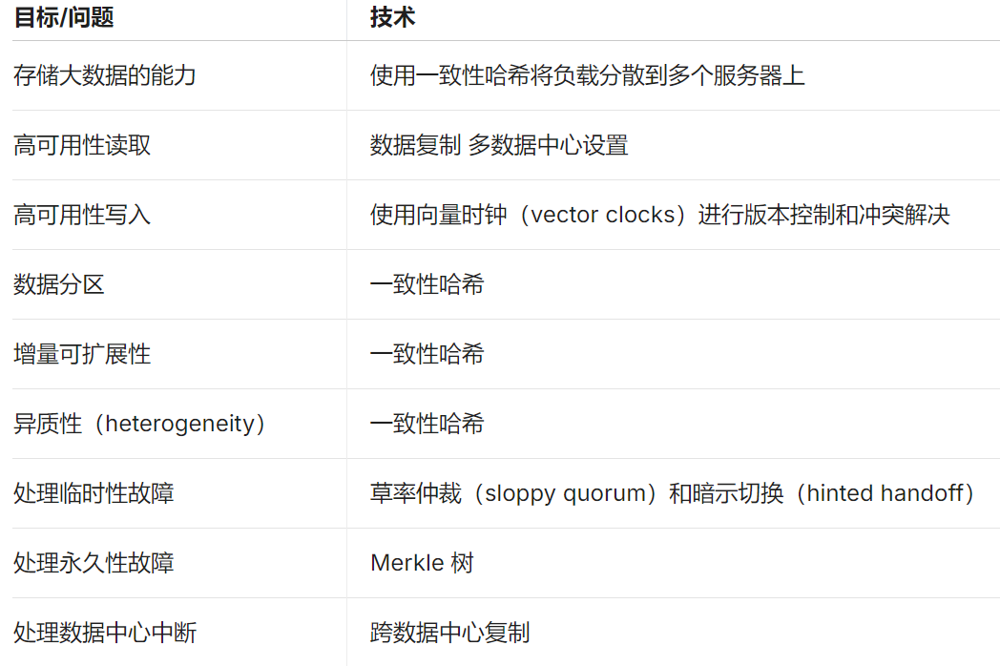

# 理解问题并确定设计范围
- 功能：实现put(k,v),get(k,v)
- 键值对的大小很小：不到 10 KB。
- 有能力存储大数据。
- 高可用性：系统响应迅速，即使在出现故障时也是如此。
- 高可扩展性：系统可以扩展以支持大数据集。
- 自动缩放：服务器的添加/删除应该根据流量自动进行。
- 可调节的一致性。
- 低延迟。

# 单一服务器的键值存储
直观方法就是用hash表实现。
优化策略：
- 数据压缩
- 常用数据在内存，其余在磁盘。

# 分布式系统
首先要确定CAP的取舍，是要AP还是CP。

## 系统组件
### 数据分区
单服务器放不下，就将数据分布在多个节点，并且保证增删数据时减少移动。
可利用一致性Hash。

#### 分区数据复制（可靠性）
为了实现高可用性和可靠性，必须在N个服务器上异步复制数据，其中N是一个可配置参数。

由于停电、网络问题、自然灾害等原因，同一数据中心内的节点经常同时发生故障。为了更好的可靠性，副本被放置在不同的数据中心，数据中心之间通过高速网络连接。
### 一致性
- Quorum 共识可以保证读写操作的一致性
  - N = 副本数
  - W = 大小为 W 的规定写入。要将写入操作视为成功，必须从 W 个副本确认写入操作。
  - R = 大小为 R 的读取规定人数。为了使读取操作被认为是成功的，读取操作必须等待至少R个副本的响应。

- W、R和N的配置是一个典型的延迟和一致性之间的权衡。如果W = 1 或R = 1，操作会很快返回，因为协调器只需要等待来自一个副本的响应。 如果 W 或 R > 1，系统提供更好的一致性； 但是，查询会变慢，因为协调器必须等待最慢副本的响应。
- 如果W+R>N，就能保证强一致性，因为至少有一个重叠的节点拥有最新的数据，以保证一致性。
- 下面是一些可能的设置：
  - 如果R=1，W=N，系统被优化为快速读取
  - 如果W=1，R=N，系统被优化为快速写入
  - 如果W+R>N，就可以保证强一致性（通常N=3，W=R=2）。
  - 如果W+R<=N，则不能保证强一致性
#### 不一致解决方案
- 复制提供了高可用性，但会导致副本之间的不一致。 版本控制和矢量锁用于解决不一致问题。
  - 版本化意味着将每一次数据修改都视为一个新的不可更改的数据版本

- 向量时钟解决版本冲突。
### 故障处理

### 系统架构图

- 客户端通过简单的API与键值存储通信：get(key)和put(key, value)。
- 协调器是一个节点，在客户端和键值存储之间充当代理。
- 节点采用一致性hash的散列方式分布在一个环上。
- 该系统是完全去中心化的，所以添加和移动节点可以自动进行。
- 数据在多个节点上复制。
- 不存在单点故障，因为每个节点都有相同的职责。

### 写入路径

### 读取路径
- 读取请求被引导到一个特定的节点后，它首先检查数据是否在内存缓存中。如果是，数据就会被返回给客户端。
- 如果数据不在内存中，就会从磁盘中检索出来。我们需要一个有效的方法来找出哪个SSTable中包含了该键。布隆过滤器通常被用来解决这个问题。

1. 系统首先检查数据是否在内存中。如果没有，就转到第2步。
2. 如果数据不在内存中，系统会检查Bloom过滤器。
3. Bloom过滤器被用来计算哪些SSTables可能包含密钥。
4. SSTables会返回数据集的结果。
5. 数据集的结果被返回给客户端。

# 总结

# Reference
- https://learning-guide.gitbook.io/system-design-interview/chapter-6-design-a-key-value-store